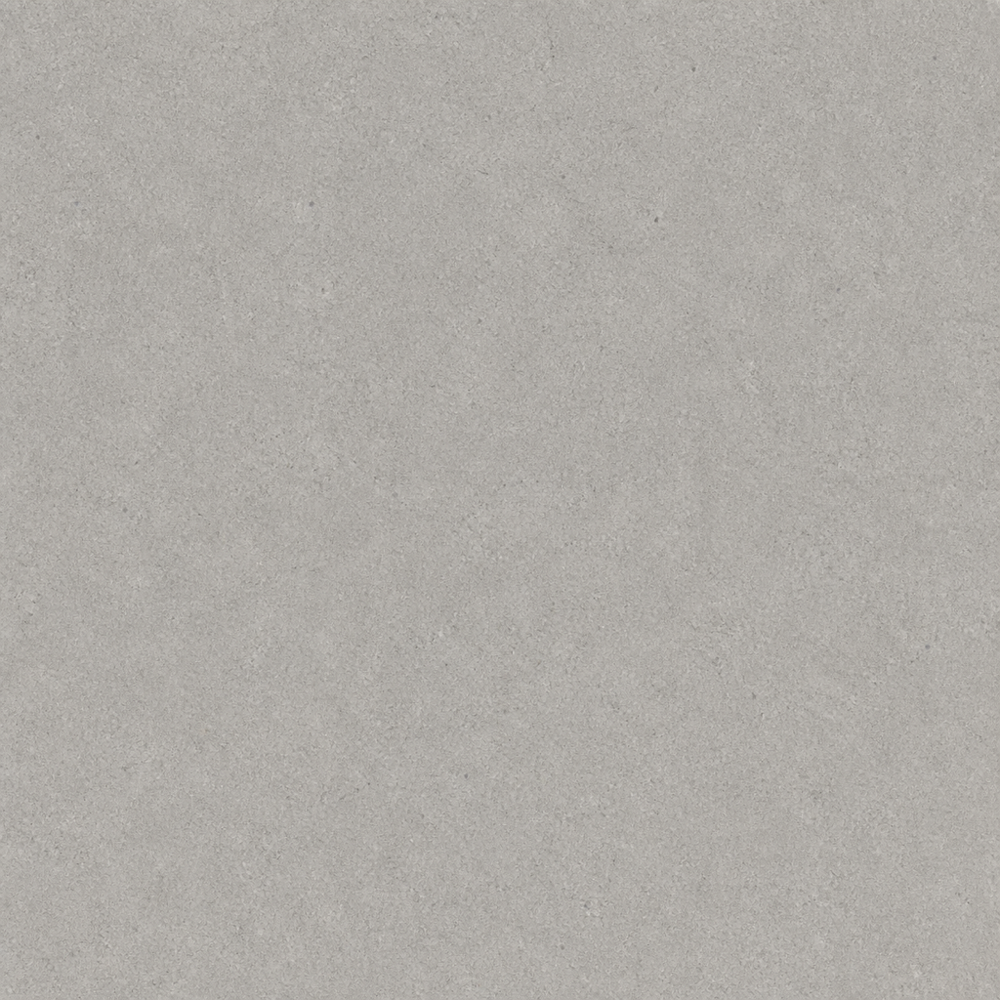
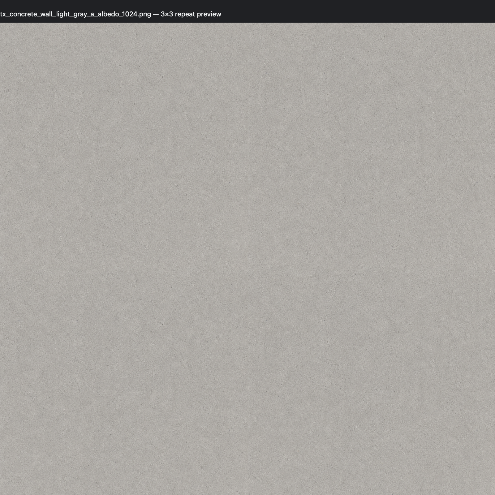

# Unity TextureGen

A small Agent Skill for making Unity URP textures with GPT Image, built around the constraints of standalone Meta Quest.

I made this for architectural VR scenes: concrete, plaster, decals, light patterns, glowing surfaces, fog, smoke, and other environment details. The goal is simple—describe the texture you need, get back a usable PNG, catch obvious tiling problems, and know which Unity import settings to start with.

This is not a Unity package or editor extension. Nothing is installed into your Unity project. The skill gives your coding agent a repeatable texture-generation and QA workflow.

<details>
<summary>中文简介</summary>

这是一个为 Unity URP 和 Meta Quest 独立端准备的 GPT Image 贴图生成 Skill，主要服务于建筑环境和光效。你可以直接描述想要的无缝墙面、灯光 Cookie、发光遮罩、雾或粒子贴图；Skill 会生成 PNG、检查明显的平铺接缝，并给出一组可用的 Unity 导入设置。

它不是 Unity 插件，也不会自动修改你的项目。

</details>

## A real example

This was the prompt:

```text
给 Quest 独立端 URP 生成一张 1024×1024 的无缝浅灰色清水混凝土外墙贴图，克制、现代、不要明显污渍。
```

| Generated texture | 3×3 tiling check |
|---|---|
|  |  |

The result is a `1024×1024` RGB PNG. For Unity, the suggested starting point is sRGB on, Wrap Mode set to Repeat, mipmaps on, and ASTC 6×6 for Android. The 3×3 preview did not show an obvious seam.

This example was generated and checked with Codex. It has not been profiled inside a shipping Quest build, so treat the import settings as a practical starting point rather than a promise.

## What it can make

- Seamless architectural surfaces such as concrete, plaster, stone, painted walls, and subtle floor materials
- Grayscale Light Cookies for spot and directional lights
- Emission masks for windows, signs, strips, and other glowing materials
- Fog, smoke, dust, particle sprites, and reusable noise textures
- Decals and small environment details

For each asset, the agent reports the image path, dimensions, intended shader role, and the Unity settings that matter. Tileable surfaces also get a 3×3 repeat check.

The focus is environments and lighting. It does not model characters, build meshes, unwrap UVs, or generate point-light cubemap Cookies.

## Install

### Codex

```bash
python3 ~/.codex/skills/.system/skill-installer/scripts/install-skill-from-github.py \
  --repo okokelly/unity-texturegen \
  --path skills/unity-texturegen
```

Start a new Codex task after installation, then try:

```text
Use $unity-texturegen to make a seamless concrete wall texture for Quest URP.
```

<details>
<summary>Install with the cross-agent Skills CLI</summary>

This option requires Node.js and npm:

```bash
npx skills add https://github.com/okokelly/unity-texturegen \
  --skill unity-texturegen \
  --agent codex \
  --global \
  --yes
```

</details>

<details>
<summary>Manual installation</summary>

```bash
git clone https://github.com/okokelly/unity-texturegen.git

# Codex
cp -R unity-texturegen/skills/unity-texturegen ~/.codex/skills/unity-texturegen

# Claude Code
cp -R unity-texturegen/skills/unity-texturegen ~/.claude/skills/unity-texturegen

# Another Agent Skills client—confirm its discovery path first
cp -R unity-texturegen/skills/unity-texturegen ~/.agents/skills/unity-texturegen
```

Restart or reload the agent session after copying the skill.

</details>

## Things you can ask for

```text
Generate a seamless, warm-gray plaster wall for a quiet brutalist interior. Keep the surface variation subtle and check it for seams.
```

```text
Create a 512×512 grayscale Light Cookie with soft window-blind shadows for a Unity spotlight.
```

```text
Make a black-background additive ground-fog sprite for a standalone Quest scene. Keep the edges soft and avoid a bright center.
```

You can name an output folder in the request. If you do not, the agent saves the file somewhere stable in the current workspace and tells you the full path.

## How the seam check works

For a tileable surface, the skill repeats the generated image in a 3×3 grid and looks for visible borders, sudden tonal changes, or repeated landmarks. If it finds a problem, it makes one repair attempt and checks again.

The loop is intentionally short. Repeated image edits tend to change the material's scale and character, so after one repair the skill reports the result honestly as `verified`, `failed`, or `unverified`.

The preview script uses only the Python 3 standard library and produces a self-contained HTML file:

```bash
python3 skills/unity-texturegen/scripts/make_tile_preview.py texture.png \
  --output /tmp/texture-3x3.html
```

## What you need

- A coding agent with a built-in raster image generator, such as GPT Image
- Python 3 for the tiling preview
- A Unity URP project

I tested the full workflow with Codex and its built-in image generator. The folder follows the Agent Skills format, so other compatible clients can read it, but they must also be able to generate images and open the local HTML preview.

## Limitations

- Generative images are not mathematically seamless. The repeat preview is a visual check, not a proof.
- Separately generated normal, roughness, and ambient-occlusion maps may not align pixel-for-pixel. The skill therefore does not promise a complete PBR texture set by default.
- Quest recommendations are conservative defaults. Final texture size and compression should still be tested on the target headset.
- The skill does not import assets into Unity or change project settings for you.

## Repository layout

```text
skills/unity-texturegen/
├── SKILL.md
├── agents/
│   └── openai.yaml
├── references/
│   ├── prompt-recipes.md
│   └── quest-texture-specs.md
└── scripts/
    └── make_tile_preview.py
```

- [`SKILL.md`](skills/unity-texturegen/SKILL.md) contains the workflow and discovery metadata.
- [`prompt-recipes.md`](skills/unity-texturegen/references/prompt-recipes.md) contains prompts for different texture types.
- [`quest-texture-specs.md`](skills/unity-texturegen/references/quest-texture-specs.md) contains the Unity and Quest defaults.
- [`make_tile_preview.py`](skills/unity-texturegen/scripts/make_tile_preview.py) builds the repeat preview without third-party packages.

The images used above live in `examples/` and are not installed with the skill.

## Contributing

Issues and pull requests are welcome, especially for new environment texture recipes, better seam checks, and Quest settings backed by real measurements. I would like to keep the core workflow small, readable, and dependency-light.

## License

[MIT](LICENSE)
